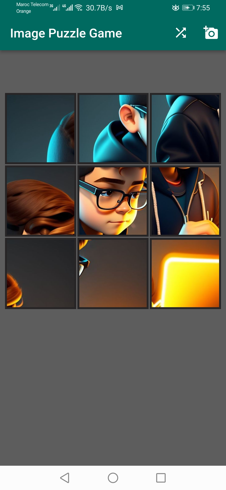

# Puzzle Image Game

A simple puzzle game app built with Flutter.

## Overview

This app allows the user to:

- Pick an image from their gallery
- Crop the image into pieces (currently supports 4 or 8 pieces)
- Shuffle the pieces into a random order
- Drag and drop pieces to reconstruct the original image

The app makes use of the image package to crop and encode images, and image_picker to select an image from the gallery.

## Features

- Select image from gallery
- Crop into multiple puzzle pieces
- Shuffle button to randomize piece order 
- Draggable puzzle pieces
- Game ends when pieces are correctly assembled
- Reset button to play again

## Implementation Details

Some key aspects of the implementation:

- `cropImage()` method splits selected image into defined number of pieces
- Pieces are saved to temporary app directory as PNG files
- `shufflePieces()` randomizes order of image pieces
- GridView.count displays pieces in grid
- Draggable widget makes pieces draggable
- GameOver overlay shown when pieces are correctly arranged

## Possible Improvements

Some ideas for enhancements:

- Allow taking photo directly instead of just gallery selection
- Add timer or move counter
- Animate transitions for shuffle and reset
- Allow selecting number of pieces
- Persist puzzle image to play again later
- Improve drag and drop UX

## License

[MIT](https://choosealicense.com/licenses/mit/)

